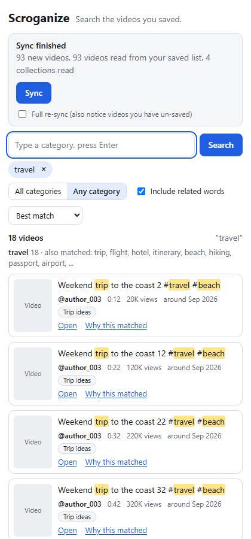

# Scroganize

**Find the videos you saved without scrolling through your Favorites.**

[](https://github.com/richardlancs/save_stack/actions/workflows/ci.yml)

Scroganize is a Chrome side-panel extension for searching **your own saved TikTok posts**, including videos and photo posts. It reads your Favorites and collections, keeps a searchable library in your browser, and helps you find a post again by its caption, creator, hashtag, or collection. TikTok is the only supported platform today.



*The side panel in a Chromium test with sample data. See the [dark theme](docs/screenshots/panel-results-dark.png) and [complete result cards](docs/screenshots/panel-grid-light.png).*

## Highlights

- **Search the way you remember.** Add categories such as `food` or `meal prep`, combine them with **All** or **Any**, and choose whether to include related words. Each result can explain why it matched.
- **Fill your library your way.** Browse your own Favorites and collections while signed in, or press **Sync** to read them in a separate window. You can pause, resume, or cancel a sync.
- **Keep control of your data.** The library stays in this browser profile. Export it as JSON, import an export, or wipe it from the side panel. A full re-sync marks videos you have unsaved as **No longer saved** instead of deleting them.

## Get started

You need **Chrome 116 or newer**. To build from this repository, use **Node.js 24** (the version used in CI) and npm:

```bash
git clone https://github.com/richardlancs/save_stack.git
cd save_stack
npm ci
npm run build
```

Open `chrome://extensions`, enable **Developer mode**, click **Load unpacked**, and select `.output/chrome-mv3`. Sign in to your own TikTok account in that Chrome profile, then click the Scroganize toolbar icon to open the side panel.

Press **Sync** for a first pass through your Favorites and collections, or browse your own Favorites to add videos as you go. Keep the sync window visible while it runs. To search, type `food`, press **Enter** to make a category chip, then press **Search**. Add more chips to narrow the results; removing one changes the draft until you press **Search** again.

For a walkthrough of sync, search, settings, and export/import, see [Getting started](docs/GETTING_STARTED.md).

## What to know

- Scroganize reads only the signed-in account's own saved data and does not upload your library. The local library is bound to one account; switching accounts requires wiping it first.
- The extension has been tested against a local mock of TikTok in Chromium. Its behavior with a real account still needs checking; the [live checklist](docs/LIVE_CHECKLIST.md) shows what to verify. TikTok can change its pages or response format, and old thumbnail links can expire.
- Sync scrolls TikTok pages for you. Automated access may conflict with TikTok's Terms of Service. Scroganize is an independent personal project and is not affiliated with TikTok.

## Project and development

Scroganize is built by the [repository contributors](https://github.com/richardlancs/save_stack/graphs/contributors). Questions and feedback are welcome in [Issues](https://github.com/richardlancs/save_stack/issues). No license is specified in the repository yet.

Developers can start with the [architecture](docs/ARCHITECTURE.md), [UI contract](docs/UI_CONTRACT.md), and [platform adapter guide](docs/ADDING_A_PLATFORM.md). Run `npm run typecheck`, `npm test`, and `npm run build && npm run check:build` before proposing changes. The [quality gates](docs/GATES.md) describe the broader Chromium tests and benchmarks.
